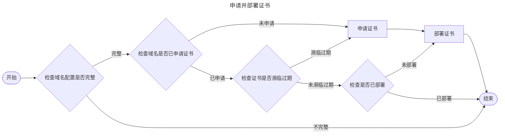

# 系统流程

## 申请并部署证书流程

Certimate 的核心流程就是申请证书并部署到目标服务上的过程，主要分为检查、申请、部署等几个步骤，一量域名启用后，这个过程会定时每天执行一次，一旦检测到域名快要过期时，会自动重新申请证书并部署到目标服务上，达到自动续期证书的目标。

### 检查

检查主要检查域名配置是否完整，检查域名是否已申请证书，检查证书是否濒临过期，检查是否已部署等操作。

- 检查域名配置是否完整，如果不完整则直接结束流程
- 检查域名是否已申请证书，如果未申请则申请证书
- 检查证书是否濒临过期，如果濒临过期则重新申请证书
- 检查是否已部署，如果未部署则部署证书

### 申请

申请证书目前使用的是 Let's Encrypt，申请证书的过程中需要证明域名是你的，所以在配置域名的时候需要填写[DNS 服务商授权配置](/docs/concept/dsn_provider_access)。
假设你在阿里云注册的域名就填阿里云的授权信息，腾讯云依此类推。
关于 DNS 服务商授权配置 详情请参考[DNS 服务商授权配置](/docs/concept/dsn_provider_access)。

### 部署

部署证书就是将申请下来的证书，根据你的配置部署到指定的目标上，所以在配置域名的时候需要填写[部署服务商授权配置](/docs/concept/deploy_provider_access)。
关于 部署服务商授权配置 详情请参考[部署服务商授权配置](/docs/concept/deploy_provider_access)。
