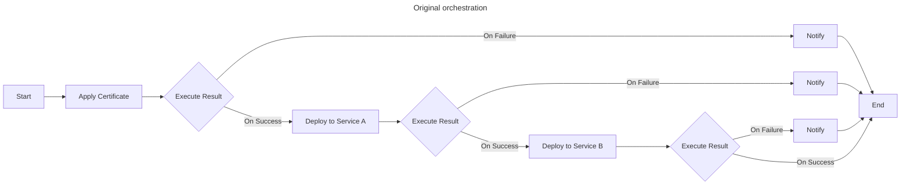
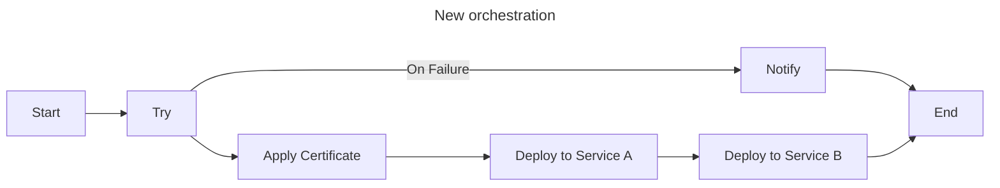

# Migrate to v0.4

v0.4.0 is a major version that is not backward compatible. This documentation will help you upgrade your Certimate service to v0.4.

---

## What changes? {#what-changes}

> Writing in progress ...

---

## Ready to upgrade {#ready-to-upgrade}

Read the _[Upgrade](/docs/getting-started/upgrade)_ guide to learn more details.

After upgrading and restarting Certimate, it will automatically run a migration program.

### From versions prior to v0.3 {#from-versions-prior-to-v0.3}

Not supported. Please upgrade to v0.3.19 or higher first.

### From v0.1.x ~ v0.2.x {#from-v0.3}

:::caution
Users below v0.3.19 need to upgrade to v0.3.19 or higher before upgrading to v0.4.0.
:::

The following data will be fully preserved:

- System settings data (except for notification channel parameters).
- Access credentials data.
- Workflow run histories and logs.

The following data will be converted to adapt to the new version:

- ACME accounts data.
- Workflow orchestration data.
- SSL certificates data.

The following data will be discarded:

- Notification channel parameters in the global settings.

### From v0.4.0-alpha {#from-v0.4.0-alpha}

All your data will be fully preserved.

---

## Breaking changes {#breaking-changes}

### Global-wide notification channels deprecated {#global-wide-notification-channels-deprecated}

In v0.4.0, the functionality related to global-wide notification channels has been deprecated. All notification channels are now managed uniformly within credentials management.

### Global-wide certificate expiration alert deprecated {#global-wide-certificate-expiration-alert-deprecated}

In previous versions, we provided a feature that sent daily expiration alerts for certificates nearing their expiry date. This was designed to help users stay aware of impending certificate expirations and take necessary actions to avoid potential impacts on production environments.

However, this feature was implemented based on scanning existing certificates within Certimate, and did not accurately reflect the certificates actually being used in the user's servers. Moreover, since certificates are renewed automatically, expiration—while inevitable—is not necessarily harmful. Excessive alerting could potentially desensitize users to notifications.

In v0.4.0, the functionality related to global-wide certificate expiration alert has been deprecated. You may choose to configure monitoring for your actual website certificates within workflows instead.

In future iterations, we plan to introduce a dedicated certificate monitoring module built on the existing workflow infrastructure. This will allow users to better track the certificate status of their servers.

### Workflow execution result branch {#workflow-execution-result-branch}

In previous versions, workflows included a node type called ​​"Execution result branch"​​, which allowed certain operations (such as sending email notifications) to be performed after a node execution failed. However, this approach had two limitations:

- It could only evaluate the success or failure of the immediately preceding node. If multiple business nodes in the workflow (e.g., ​​Apply Certificate -> Deploy to Service A -> Deploy to Service B​​) required such evaluation, complex orchestration would be necessary.
- Entering the failure branch implicitly interrupted the entire workflow, making it unsuitable for scenarios where certain errors needed to be ignored.

In v0.4.0, we have refactored this functionality by drawing inspiration from syntactic structures like `try-catch-finally` found in certain programming languages. Now, you can transform previously complex orchestration into a simpler one:

Please note that the migration program cannot merge these branches automatically. We recommend manually adjusting existing workflows after the upgrade to consolidate the original multiple sequential execution result branch nodes into a single one.

### Certificate Deployment with wildcard domains {#certificate-deployment-with-wildcard-domains}

In previous versions, due to the lack of a unified specification for deployment providers implemented by various contributors, certain cloud services supporting wildcard resolution (such as CDNs) exhibited three distinct behavioral logics when a wildcard domain (starting with `*`) was entered in the deployment node:

- **​​Exact Match**​​: Deployment only targets the wildcard site itself. For example, `*.example.com` would only match the `*.example.com` site.
- **​​Wildcard Match​**​: Deployment targets all sites matching the wildcard domain. For example, `*.example.com` would match multiple sites like `www.example.com`, `image.example.com`.
- ​**​Certificate-based Match​**​: Deployment targets all sites covered by the certificate. The certificate might be a multi-domain certificate covering, for instance, `www.foo.com`, `www.bar.com`, and `www.baz.com`. Even if the user only entered `*.foo.com`, it would match multiple sites like `www.foo.com`, `www.bar.com`, and `www.baz.com`.

This ambiguity caused confusion for users during operation.

To avoid unnecessary complications, we have unified the default behavior for wildcard domains to ​​**Exact Match​**​ in v0.4.0. The following deployment providers are affected:

- `​​Tencent Cloud - CDN (Content Delivery Network)​​`: Previously used **Certificate-Based Match**.
- ​`​Tencent Cloud - ECDN (Enterprise Content Delivery Network)​`​: Previously used **Certificate-Based Match**.
- `Volcengine - CDN (Content Delivery Network)​`​: Previously used **Wildcard Match**.
- `​​Volcengine - Video Live`​​: Previously used **Wildcard Match**.

Additionally, we have introduced a new configuration option called ​​"Domain match pattern"​​ for the above providers. You can manually adjust this value in the deployment node to maintain the same behavior as in previous versions.

In future iterations, we plan to gradually introduce the ​​"Domain match pattern"​​ configuration for all deployment providers that support wildcard resolution.

### Certificate deployment to Tencent Cloud CLB {#certificate-deployment-to-tencentcloud-clb}

In previous versions, the deployment provider `Tencent Cloud - CLB (Cloud Load Balancer)` included a configuration item called "Resource type".

In v0.4.0, we have deprecated the option "Deploy via SSL Certificate Service" to streamline redundant logic. You may choose other deployment methods, or switch to the `Tencent Cloud - Deploy via SSL Certificate Service` deployment provider.
