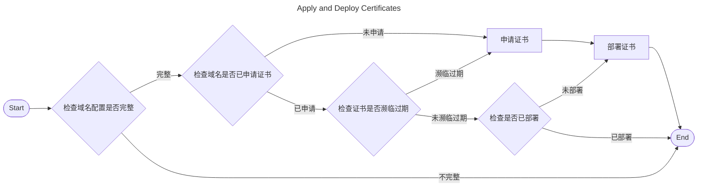

# Mechanism

Certimate implements the ACME client protocol, which can obtain free certificates from CA such as Let's Encrypt and ZeroSSL.

---

## Process {#process}

The work process of Certimate is as follows:

1. Users fill in the certificate application information on Certimate WebUI, including domain names, authorizations, and so on.
2. Certimate sends API requests to CA to apply for an SSL certificate.
3. Certimate stores the certificate information, and automatically renews the certificate before it is expired.
4. Certimate sends API requests to the service providers to deploy the certificate.

Certimate will periodically repeat the above process to achieve the purpose of renewing the certificate.

During this process, Certimate requires authorization information to control your domain name DNS resolution records or access your cloud service resources.

Read the _[Terminology](./terminology)_ guide to learn more details.
