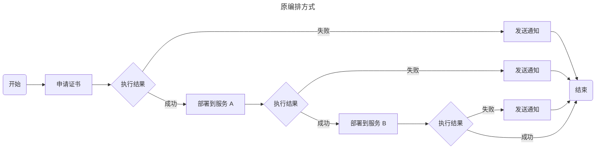
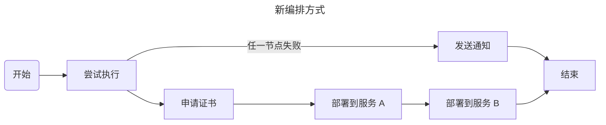

# 迁移到 v0.4

v0.4.0 是一个不向后兼容的大版本。本文档将帮助你将已有的 Certimate 服务升级到 v0.4 版本。

温馨提示，篇幅过长，你可以利用目录导航快速跳转到要阅读的内容。

---

## 有哪些变化？ {#what-changes}

以下是一些主要区别：

### 新的工作流编辑器 {#new-workflow-editor}

借助于 [FlowGram](https://github.com/bytedance/flowgram.ai) 的强大能力，我们重新设计了工作流编辑器，除视觉样式上的变化外，还包含了若干新的功能：

- 新的节点类型：延迟等待；
- 画布自由拖拽及滚轮缩放；
- 横纵向布局切换；
- 小地图导航；
- 拖拽调整节点顺序；
- 导入、导出工作流编排为 YAML 或 JSON 格式。

### 支持 HTTP-01 质询 {#support-http01-challenge}

申请证书时可以选择通过 HTTP-01 质询（基于文件）完成域名所属权的验证。

但要注意，HTTP-01 质询无法签发泛域名证书。

### 支持从本地或 URL 中上传证书 {#support-uploading-certificates-from-local-paths-or-urls}

在之前的版本中，我们允许用户上传自有证书到 Certimate、并通过 Certimate 部署证书到其他平台。但这仍需要用户在前端表单中手动选择证书文件，只能算作一种“半自动化”。

现在，你可以选择填写一个本地路径或 URL 地址，Certimate 会从该位置读取证书文件。这样一来，你可以通过其他方式签发证书（例如购买商业证书，或使用其他 ACME 工具），但无需重新编排 Certimate 工作流，以实现完全地自动化部署工作。

### 支持通知内容模板语法 {#support-notification-template-syntax}

你可以在通知主题或正文中插入变量（例如：工作流名称、证书域名、证书到期时间等），以复用通知模板。

### 更多提供商支持 {#more-providers-supported}

新增了以下 DNS 提供商：

- Vultr。

新增了以下部署提供商：

- 华为云 OBS 对象存储服务。

新增了以下证书颁发机构：

- Actalis SSL；
- GlobalSign Atlas；
- Sectigo；
- 同时，可在全局设置中配置自定义 ACME 证书颁发机构。

### 改进 UI {#improved-ui}

新的用户界面，更好地适配超宽屏和移动端，并改进了许多交互体验。

### 一些破坏性变化 {#some-breaking-changes}

请阅读下方章节了解更多细节。

---

## 准备升级 {#ready-to-upgrade}

阅读[升级](/docs/getting-started/upgrade)指南以了解更多细节。

升级并重启 Certimate 后，Certimate 会自动运行一个迁移程序。

:::caution
一旦升级完成，将不可再降级回低版本。如需回滚，请提前备份旧版本数据。
:::

### 从 v0.3 之前的版本升级 {#from-versions-prior-to-v0.3}

不支持，请先升级到 v0.3。

### 从 v0.3 升级 {#from-v0.3}

:::caution
低于 v0.3.19 版本的用户，需要先升级到 v0.3.19 或更高版本后，再升级到 v0.4.0。
:::

你的以下数据将完全得到保留：

- 系统设置数据（除通知渠道参数外）。
- 授权凭据数据。
- 工作流运行历史及日志。

你的以下数据将被转换以适配新版本：

- ACME 账号数据。
- 工作流编排数据。
- SSL 证书数据。

你的以下数据将被废弃：

- 系统设置中的通知渠道参数。

### 从 v0.4.0-alpha 升级 {#from-v0.4.0-alpha}

完全兼容，你的全部数据将完全得到保留。

---

## 破坏性变化 {#breaking-changes}

### 全局推送通知渠道已废弃 {#global-wide-notification-channels-deprecated}

在 v0.4.0 中，全局推送通知渠道相关功能正式废弃。现在，所有的通知渠道已被纳入到授权凭据中统一管理。

### 全局证书过期告警已废弃 {#global-wide-certificate-expiration-alert-deprecated}

在之前的版本中，我们提供了一种每日发送证书临近过期告警通知的功能。其设计目的是为了让用户在证书过期前加以关注，并采取某些行动，以免对生产造成影响。

但因为它是基于扫描 Certimate 内已有的证书实现的，并不真正体现用户的业务系统中实际所使用的证书。而且因为证书是自动化续期的，也就是说，无论如何证书都是会过期的，但它并不一定是有害的，滥用告警提醒反而可能会降低用户的敏感度。

在 v0.4.0 中，全局证书过期告警相关功能正式废弃。现在，你可以选择在工作流中配置监控你的真实网站证书。

在未来的版本迭代中，我们计划在现有的工作流基础之上引入单独的证书监控模块，使得用户可以更好地关注自身业务系统的证书情况。

### 工作流执行结果分支 {#workflow-execution-result-branch}

在之前的版本中，工作流中有一种“执行结果分支”类型的节点，它能在某一节点执行失败后进行某些操作（例如发送邮件通知）。但存在两个缺陷：

- 只能针对前一个节点判断执行成功或失败。如果工作流中包含多个业务节点（例如：申请证书 -> 部署到服务 A -> 部署到服务 B）都需要此类判断时，则需要复杂的编排。
- 进入失败分支后会隐式地中断工作流，无法满足允许忽略某些错误的场景。

在 v0.4.0 中，我们借鉴了许多编程语言中 `try-catch-finally` 这样的语法结构来重构了该功能。现在，你可以将原本复杂的编排转换为简单的编排：





需要注意的是，迁移程序无法自动合并这些分支，我们建议你在升级完成后手动调整已有的工作流，将原来的多个串行的执行结果分支节点合并为一个。

### 证书部署时的泛域名匹配 {#certificate-deployment-with-wildcard-domains}

在之前的版本中，由于各贡献者实现的部署提供商没有统一规范，在某些支持泛解析的云服务（如 CDN）中，如果在部署节点中输入一个开头为 `*` 的域名（即泛域名），会产生三种不同的行为逻辑：

- 精确匹配，只部署到泛解析站点本身。即 `*.example.com` 只会匹配 `*.example.com` 这一个站点。
- 通配符匹配，部署到所有匹配该泛域名的站点。即 `*.example.com` 会匹配 `www.example.com`、`image.example.com` 之类的多个站点。
- 根据证书自动匹配，部署到所有匹配该证书的站点。证书可能是一张多域名证书，例如同时包含 `www.foo.com`、`www.bar.com`、`www.baz.com`，即便用户只输入了 `*.foo.com`，也会同时匹配到 `www.foo.com`、`www.bar.com`、`www.baz.com` 之类的多个站点。

这使得用户在使用过程中会产生歧义。

为了避免不必要的困扰，在 v0.4.0 中，我们统一了泛域名默认的行为逻辑为“精确匹配”。以下部署提供商会受到影响：

- `腾讯云 - 内容分发网络 CDN`。原行为逻辑是“根据证书自动匹配”。
- `腾讯云 - 全站加速网络 ECDN`。原行为逻辑为是“根据证书自动匹配”。
- `火山引擎 - 内容分发网络 CDN`。原行为逻辑是“通配符匹配”。
- `火山引擎 - 视频直播 Live`。原行为逻辑是“通配符匹配”。

与此同时，我们为上述这些部署提供商额外提供了“域名匹配模式”这一配置项，你仍可以在部署节点中手动修改它的值为其他模式，来保持与之前版本相同的行为逻辑。

在未来的版本迭代中，我们计划逐步为每个支持泛解析的部署提供商都引入“域名匹配模式”这一配置项。

### 证书部署到腾讯云 CLB 负载均衡器 {#certificate-deployment-to-tencentcloud-clb}

在之前的版本中，部署提供商 `腾讯云 - 负载均衡 CLB` 有一个配置项“证书部署方式”。

在 v0.4.0 中，我们废弃了“通过 SSL 服务部署到云资源实例”这一可选项，以精简冗余逻辑。现在，你可以选择其他部署方式，或者切换到 `腾讯云 - 通过 SSL 证书服务创建部署任务` 这一部署提供商。

### 多进程模式 {#multi-process-mode}

在之前的版本中，你只能在终端的 `stdout`/`stderr` 中查看申请证书过程中的 ACME 相关日志。这是因为底层依赖 go-acme/lego 的限制，只提供了一个全局的日志记录器。但由于它是全局的，在并发时，我们无法准确区分其记录的日志究竟来自哪一个工作流。

在 v0.4.0 中，我们引入了多进程模式，每个工作流在执行申请证书节点时，会在独立的子进程中工作。这样一来，申请证书过程中的 ACME 相关日志就可以被记录到工作流日志中了，你可以在 WebUI 中查看到它们。

但是，尽管我们采用了许多优化手段，这仍会带来一定的性能开销。如果你的设备对此敏感，可以通过环境变量关闭这一特性：

```bash
export CERTIMATE_WORKFLOW_MULTIPROC=0
```

### 移除对证书颁发机构 Buypass 的支持 {#remove-support-for-ca-buypass}

Buypass 将于 2025 年 10 月 15 日起停止提供 SSL 证书颁发服务。详情请见[官方公告](https://www.buypass.com/products/tls-ssl-certificates/discontinues-issuance-of-tls-ssl-certificates)。

在 v0.4.0 中，我们从内置的证书颁发机构列表中移除了 Buypass。如果你的工作流中有依赖此机构来申请证书，请在升级完成后手动调整编排，切换到其他证书颁发机构。

---

## 已知问题 {#known-issues}

### GitHub Issue #982

[点此查看原文](https://github.com/certimate-go/certimate/issues/982)。
