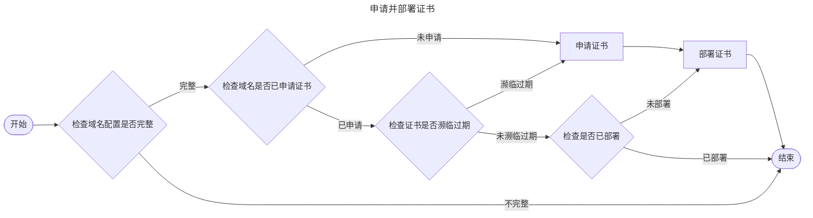

# 工作机制

Certimate 实现了 ACME 客户端协议，可以从 Let's Encrypt、ZeroSSL 等证书颁发机构生成免费的证书。

---

## 流程 {#process}

Certimate 的主要工作流程如下：

1. 用户通过 Certimate WebUI 填写申请证书的参数，包括域名、DNS 服务商等信息。
2. Certimate 通过 API 向证书颁发机构的发起申请请求，获取 SSL 证书。
3. Certimate 存储证书信息，并在证书即将过期时自动续期。
4. Certimate 通过 API 向云厂商发起部署请求，将证书部署指定服务上。

通过用户设置的触发间隔，Certimate 会定期重复执行上述流程，以达成续期证书的目的。

在此过程中，Certimate 需要授权信息以控制你的域名 DNS 解析记录，或访问你的云服务资源。

阅读[名词解释](/docs/reference/terminology)指南以了解更多细节。
